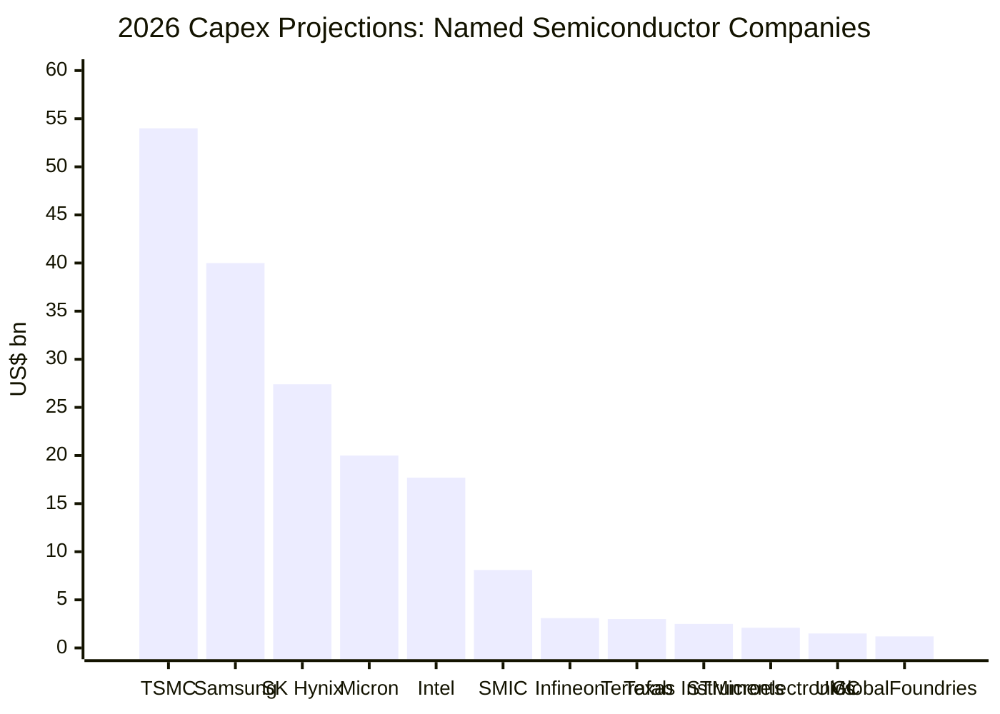

- tags:: [[capex]], [[hyperscalers]], [[semiconductor]], [[Microsoft]], [[Meta]], [[Google]], [[Amazon]], [[TSMC]], [[Samsung]], [[Micron]], [[SK Hynix]]

- ## 2026 Capex Projections: Semiconductor Companies vs Hyperscalers
	- **Source memos**:
		- [2026-04-16-semiconductor-capital-expenditures-2024-2026.md](/Users/hc/Logseq-github-Codex/pages/stock-memos/2026-04-16-semiconductor-capital-expenditures-2024-2026.md)
		- [2026-04-29-us-big-4-tech-capex-projections-2026.md](/Users/hc/Logseq-github-Codex/pages/stock-memos/2026-04-29-us-big-4-tech-capex-projections-2026.md)
	- **Scope**:
		- this memo charts `2026` capex projections for named semiconductor companies and the US Big 4 hyperscalers
		- all figures are in **US$ billions**
	- **Method**:
		- semiconductor figures are direct `2026` company values from the semiconductor capex memo
		- hyperscaler figures use low/high ranges where ranges were provided
		- single-point hyperscaler figures are shown as the same value on both the low and high series
		- segment totals and `Others` rows are excluded so the chart focuses on named companies

- ## Semiconductor Companies Chart

- ## Hyperscalers Chart

```mermaid
xychart-beta
    title "2026 Capex Projections: Big 4 US Hyperscalers"
    x-axis ["Amazon","Microsoft","Google","Meta"]
    y-axis "US$ bn" 0 --> 220
    bar "Low" [200,190,180,125]
    bar "High" [200,190,190,145]
```

- ## Combined 2026 Table

	| Category | Company | 2026 capex low | 2026 capex high | Notes |
	|---|---|---:|---:|---|
	| Hyperscaler | Amazon | 200 | 200 | Reaffirmed record plan at roughly `US$200B`. |
	| Hyperscaler | Microsoft | 190 | 190 | Guidance above prior `US$150B` estimate. |
	| Hyperscaler | Google | 180 | 190 | Raised range and flagged significant `2027` increase. |
	| Hyperscaler | Meta | 125 | 145 | Raised range on component costs and data center buildouts. |
	| Semiconductor | TSMC | 54.0 | 54.0 | Largest named semiconductor-company capex in the source memo. |
	| Semiconductor | Samsung | 40.0 | 40.0 | Largest memory-company capex in the source memo. |
	| Semiconductor | SK Hynix | 27.4 | 27.4 | Strong memory upcycle / AI-linked capex expansion. |
	| Semiconductor | Micron (FYE Sep.) | 20.0 | 20.0 | Large step-up versus `2025`. |
	| Semiconductor | Intel | 17.7 | 17.7 | Flat versus `2025` in the source memo. |
	| Semiconductor | SMIC | 8.1 | 8.1 | Flat in `2026` versus `2025`. |
	| Semiconductor | Infineon (FYE Sep.) | 3.1 | 3.1 | Rebounds from `2025`. |
	| Semiconductor | Terrafab | 3.0 | 3.0 | Only `2026` value was shown in the original screenshot-based memo. |
	| Semiconductor | Texas Instruments | 2.5 | 2.5 | Meaningful cut versus prior years. |
	| Semiconductor | STMicroelectronics | 2.1 | 2.1 | Small rebound from `2025`. |
	| Semiconductor | UMC | 1.5 | 1.5 | Down slightly versus `2025`. |
	| Semiconductor | GlobalFoundries | 1.2 | 1.2 | Small in absolute dollars despite high growth rate. |

- ## Quick Comparisons
	- The hyperscaler spending scale is an order of magnitude larger than individual semiconductor-company capex.
	- Even the lowest Big 4 hyperscaler in the range, [[Meta]] at `US$125B`, is still more than `2x` [[TSMC]]'s `US$54B` projected capex.
	- [[Amazon]] plus [[Microsoft]] alone imply roughly `US$390B` of `2026` capex, which exceeds the full `US$200B` `2026` semiconductor-industry total shown in the semiconductor memo.
	- Within semiconductors, [[TSMC]], [[Samsung]], [[SK Hynix]], and [[Micron]] are the dominant named capex spenders in the source dataset.

- ## Caveats
	- The two source memos do not represent the same economic layer: one tracks semiconductor manufacturers, the other tracks cloud / platform operators.
	- Hyperscaler figures include broader data center and infrastructure spending, not just chip-related capex.
	- [[Meta]] and [[Google]] are ranges; the chart shows both low and high values rather than forcing a midpoint.
